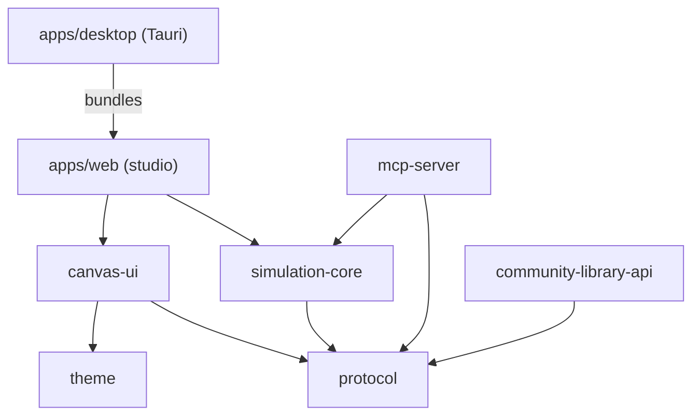

# System overview

ProcessForge is a flowsheet editor and simulator. The engineer builds the
flowsheet. An AI model can write new unit operations as data (contracts), and
the engine decides whether each contract is acceptable. The model never runs
the simulation.

## Packages

| Package | What it contains |
| :--- | :--- |
| `@process-forge/protocol` | Zod schemas for nodes, ports, streams, graphs and projects; unit conversions; graph validation and capacity-based bottleneck analysis; the unit-op contract format, its expression evaluator and its review gates; the CAD drawing template library; the decision layer (`src/decisions`, see [Plan 0001](../plans/0001-jev-decision-layer.md)). |
| `@process-forge/simulation-core` | The discrete-event engine: a priority queue of events, per-unit state tracking, OEE reports, and a seeded RNG. |
| `@process-forge/canvas-ui` | The React Flow canvas, equipment drawings and nozzle placement, the unit-op creator, the Engineer Studio dock, the community library modal, and the model clients (Claude, OpenAI, Gemini, OpenRouter, Ollama). |
| `@process-forge/theme` | Osaka Jade colour tokens, CSS variables, a Tailwind preset. |
| `@process-forge/mcp-server` | The MCP server. It exposes the protocol and engine as tools to an MCP client. |
| `@process-forge/community-library-api` | A Cloudflare Worker with a D1 database: Google sign-in, cloud project storage, the community unit-op library. |
| `apps/web` | The studio application: landing page (web only), project storage, account, cloud sync. |
| `apps/desktop` | The Tauri v2 shell. It bundles the `apps/web` build and adds Rust commands for the keychain, updates, OAuth loopback sign-in and the MCP bridge. |

## Building a flowsheet

1. The engineer places standard units from the equipment palette, or inserts a
   unit op from the community library.
2. Each unit is drawn as equipment. Ports appear as nozzles, which the engineer
   can move; streams attach at the nozzles.
3. `validateProcessGraph` (protocol) checks that every edge references real
   ports and that connected ports have the same flow dimension. It also
   estimates each unit's capacity and names the lowest as the bottleneck.

## Designing a unit op

A unit-op contract (`packages/protocol/src/unitop/contract.ts`) declares
ports, parameters with units and bounds, derived values written as
expressions, constraints with ERROR or WARNING severity, a behavior
(`DISCRETE_CYCLE` or `CONTINUOUS_RATE`) and a drawing.

`executeValidateUnitOp` (`unitop/review.ts`) checks a contract through four
gates:

1. **Schema:** the contract has the right shape.
2. **Static analysis:** every expression parses and every name it uses
   resolves.
3. **Physics:** the contract evaluates and every ERROR constraint holds.
4. **Drawing:** the drawing gives every port a nozzle.

A contract is accepted only if all four pass. Otherwise the result lists what
to fix.

Two loops use the same gates:

- **In the app** (`canvas-ui/src/ai/unitOpAuthor.ts`): the user's configured
  model writes a contract, the gates review it, and the failures go back to
  the model, up to three rounds.
- **From an MCP client**: the client calls `design_unit_op` for the rules and
  an example, writes the contract, and calls `validate_unit_op` until it is
  accepted. With the desktop app open, `add_unit_op_to_flowsheet` puts it on
  the open flowsheet.

An accepted contract becomes a node whose `config.contract` holds the
contract.

## Running a simulation

`simulateProcess(graph, durationMinutes, { seed })` runs the discrete-event
engine:

- Fillers, conveyors, labelers and palletizers have built-in handlers.
  Contract nodes with `DISCRETE_CYCLE` behavior run generically from their
  evaluated cycle time and units per cycle.
- Each unit's time is attributed to BUSY, BLOCKED, STARVED, FAILED or IDLE
  (breakdowns are not simulated yet, so FAILED is unused; liquid units are stepped each second, see 04-simulation-math.md). A unit is blocked when downstream buffers are full and starved when nothing
  arrives from upstream.
- Contracts are evaluated once before the clock starts. A contract that fails
  to evaluate, or violates an ERROR constraint, stops the run with an error.
- `CONTINUOUS_RATE` contracts are evaluated at steady state. The engine does
  not integrate continuous balances over time.
- The result contains totals, per-unit OEE reports, a per-minute telemetry
  log, and the seed, so the run can be repeated exactly.

The formulas are in [04-simulation-math.md](04-simulation-math.md).

## Storage and accounts

- A project (`SimulationProject`, `protocol/src/storage.ts`) holds the graph,
  chat histories and the last run's metrics. It can be saved to a local
  `.pfg.json` file or browser storage with no account.
- Signing in with Google lets the user save projects to the cloud API and
  publish unit ops to the community library.

Security details are in [02-trust-and-security.md](02-trust-and-security.md).
