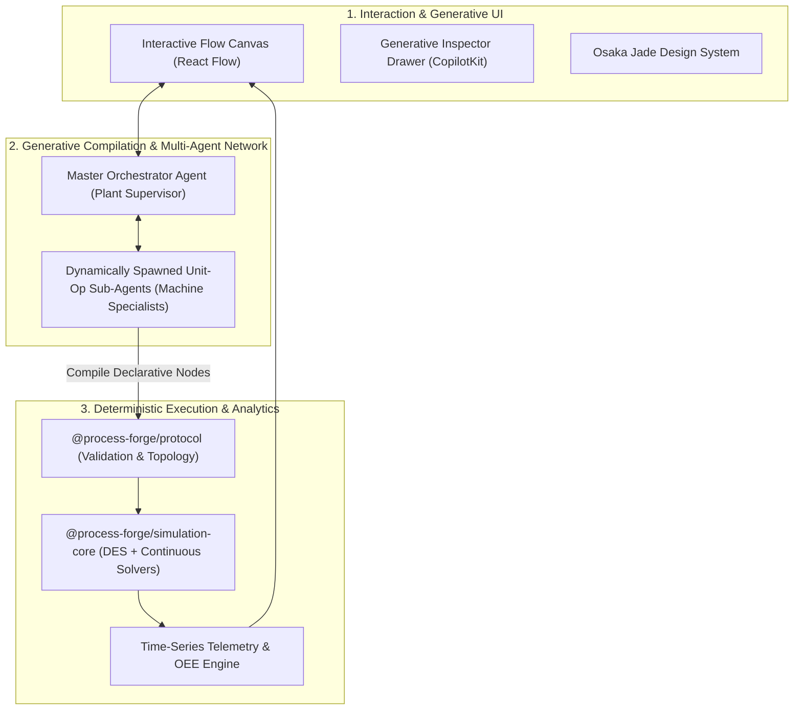

# Architecture: System Overview

## 1. What is ProcessForge?

**ProcessForge** is a digital twin and simulation platform engineered for real-world manufacturing and industrial packaging lines. Rather than focusing on complex thermodynamic equilibrium that slows down general simulation, ProcessForge models the actual operational dynamics of factories:
- **Continuous Fluid Dynamics:** Batch reactors, surge tanks, pump discharge rates, pipe diameters, viscosity, and fluid pressures.
- **Discrete-Event Packaging Lines:** Multi-nozzle fillers, indexing conveyors, high-speed labelers, reject stations, and automatic palletizers.
- **Factory Performance Analytics:** Overall Equipment Effectiveness (OEE), buffer queue depths, starvation bottlenecks, and machine failure distributions (MTBF/MTTR).

---

## 2. The Core Mental Model

ProcessForge separates concerns into three distinct layers:

1. **The Human-in-the-Loop Canvas:** Users visually compose process graphs or prompt natural language agents to generate machinery.
2. **The Multi-Agent Compiler:** Agents synthesize physical dimensions, check flow continuity, and render dynamic controls via CopilotKit.
3. **The Deterministic Physics Core:** An engine running in Rust/Wasm and TypeScript that computes events in milliseconds (>10,000x real time) without LLM hallucinations.

---

## 3. Monorepo Package Responsibility

| Package | Responsibility | Primary Consumer |
| :--- | :--- | :--- |
| **`@process-forge/protocol`** | Authoritative Zod schemas, physical unit conversions, graph validation rules, and agent communication DTOs. | Core, Canvas, Agents |
| **`@process-forge/simulation-core`** | Binary min-heap priority queue, discrete-event loop, continuous buffer tracking, and factory OEE calculators. | Canvas UI, Headless CLI |
| **`@process-forge/theme`** | Osaka Jade design tokens, Tailwind preset, CSS custom properties, and React Flow visual styling. | Web App, Desktop Shell |
| **`@process-forge/scaffold-registry`** | Anti-laziness tracking system, scaffold manifest validation, and AST source scanner. | CI Pipeline, Pre-commit |

---

## 4. Operational Flow: Adding a 10-Nozzle Filler

Here is the exact lifecycle of an industrial machine within ProcessForge:

1. **User Action:** The user drags a filler node onto the canvas after a batch reactor, or types: *"Add a 10-nozzle paint filler running 40 cans per minute."*
2. **Agent Instantiation:** The Master Orchestrator checks upstream reactor flow (40 gpm) and spawns `UnitOpAgent[Filler-01]`.
3. **Parameter Synthesis:** The sub-agent calculates the required cycle time ($15\text{ s}$ per 10-can cycle), assigns buffer requirements ($50\text{ cans}$), and computes expected line scrap.
4. **Generative UI:** CopilotKit renders a custom interactive drawer in the canvas inspector with nozzle tuning sliders and physical continuity badges.
5. **Deterministic Simulation:** Once approved, the node enters `@process-forge/simulation-core`. During execution, downstream bottlenecks (e.g. a slower labeler) generate realistic backpressure blocking on the filler.
