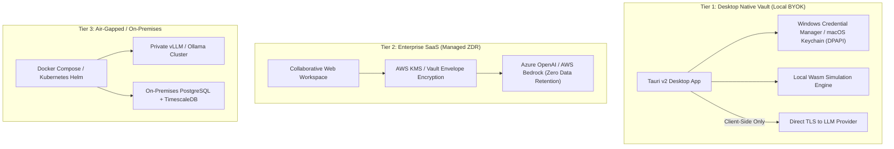

# Architecture: Trust, Security & Credential Isolation

## 1. The Enterprise Trust Problem

Many early AI applications built on ephemeral serverless platforms (e.g. basic Vercel + Supabase stacks) fail in industrial enterprise settings due to three core friction points:

1. **The "BYOK" (Bring Your Own Key) Paranoia:** When an industrial engineer is greeted with a web input box saying *"Paste your OpenAI API Key"*, they immediately suspect their key might be stored in plain text or exfiltrated through cloud logs.
2. **Proprietary Process IP:** Industrial plant recipes (batch dwell times, conveyor index speeds, scrap rates, equipment layouts) represent confidential manufacturing trade secrets. Plant managers will not enter proprietary lines into an unvetted cloud database.
3. **Stateless Limitations:** Ephemeral serverless functions time out after 15–60 seconds, preventing long-running factory simulations and persistent WebSocket telemetry streams.

---

## 2. The ProcessForge Three-Tier Security Model

ProcessForge eliminates the "hobbyist wrapper" perception by providing three distinct operational modes:

### Tier 1: Desktop Native Vault (Zero-Knowledge BYOK)
- **Target:** Individual engineers, plant consultants, security-restricted corporate laptops.
- **Storage:** User API keys are stored exclusively in the OS-native credential store (Windows Credential Manager via DPAPI; macOS Keychain) using Tauri secure storage plugins.
- **Data Flow:** Model inference calls are dispatched directly from the user's desktop over client-side TLS to the provider (OpenAI, Anthropic, Google).
- **Security Guarantee:** **Zero API keys, plant topologies, or prompt contents ever touch ProcessForge cloud servers.**

### Tier 2: Enterprise SaaS Managed Gateway (No BYOK)
- **Target:** Collaborative multi-user engineering teams requiring real-time shared canvases.
- **Security:** Model inference is routed through enterprise model endpoints (AWS Bedrock / Azure OpenAI) under signed **Zero Data Retention (ZDR)** agreements. User data is never used for training or persisted outside the session tenant.

### Tier 3: Air-Gapped On-Premises Deployment
- **Target:** Defense manufacturing, pharmaceutical plants, mission-critical facilities.
- **Distribution:** Distributed with production Docker Compose and Helm charts.
- **Architecture:** Runs completely inside the customer's private VPC or offline plant intranet, pairing with local inference runtimes (e.g. vLLM or Ollama).
