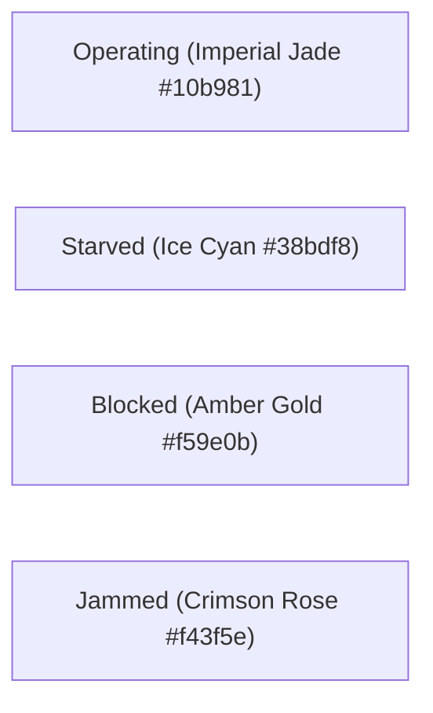

# Architecture: Osaka Jade Design System

## 1. Aesthetic Rationale & Omarchy Linux Inspiration

Industrial software historically suffers from two visual extremes:
1. Clunky 1990s gray-on-gray SCADA interfaces that cause severe operator eye fatigue.
2. Generic, blinding white SaaS dashboards built on standard component libraries.

ProcessForge adopts **"Osaka Jade"** as its default visual theme. Inspired by the high-contrast aesthetic of the **Omarchy Linux** desktop environment, Osaka Jade pairs deep, light-absorbing mineral slate surfaces with radiant imperial jade and ice cyan accents.

---

## 2. Palette Specification

| Token | Hex Value | Purpose |
| :--- | :--- | :--- |
| `pf.bg.base` | `#0c1214` | Main window and application shell background |
| `pf.bg.canvas` | `#0f171a` | Flow diagram canvas background |
| `pf.bg.surface` | `#152024` | Machine node containers and property cards |
| `pf.bg.elevated` | `#1a292f` | CopilotKit inspector drawers, modals, and tooltips |
| `pf.jade.500` | `#10b981` | Primary Imperial Jade brand accent & operating status |
| `pf.jade.glow` | `#2dd4bf` | Active node selection glow and continuous fluid wires |
| `pf.status.starved` | `#38bdf8` | Ice Cyan indicator: machine starved of input |
| `pf.status.blocked` | `#f59e0b` | Amber Gold indicator: downstream buffer backpressure |
| `pf.status.failed` | `#f43f5e` | Crimson Rose indicator: machine fault or jam |
| `pf.text.primary` | `#e8f2f0` | High-contrast cool silver-mint for crisp readability |

---

## 3. Machine State Visual Feedback

ProcessForge provides instant visual feedback across all canvas nodes:

When a machine is blocked by downstream backpressure, its border pulses with an amber aura (`0 0 10px rgba(245, 158, 11, 0.6)`), and the conveyor wire leading to it turns amber, immediately drawing the engineer's eye to the root cause.
