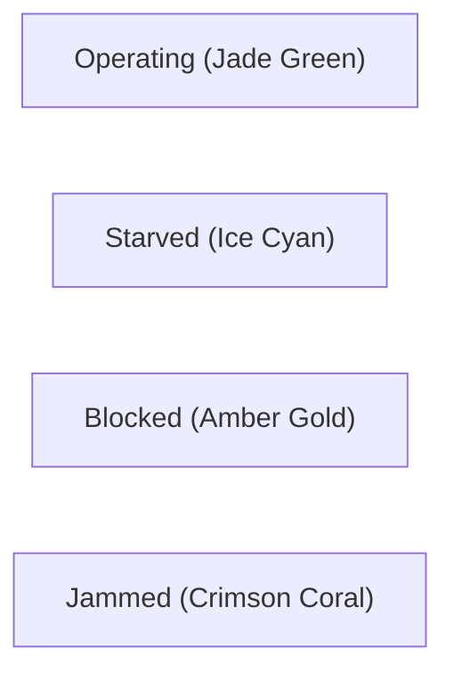

# Architecture: Osaka Jade Design System (Dual Dark & Light)

## 1. Aesthetic Rationale & Omarchy Linux Inspiration

Industrial software historically suffers from two visual extremes:
1. Clunky 1990s gray-on-gray SCADA interfaces that cause severe operator eye fatigue.
2. Generic, blinding white SaaS dashboards built on standard component libraries.

ProcessForge adopts **"Osaka Jade"** as its signature visual design system, featuring both **Dark** and **Light** variants. The system is distilled directly from the official **Omarchy Linux** desktop theme ([Justikun/omarchy-osaka-jade-theme](https://github.com/Justikun/omarchy-osaka-jade-theme)) and its upstream Neovim bamboo core ([ribru17/bamboo.nvim](https://github.com/ribru17/bamboo.nvim)):
- **Dark Theme (Midnight Rice / Obsidian Forest)**: Pairs deep light-absorbing forest slate surfaces (`#111c18` / `#11221c`) with radiant bamboo jade (`#549e6a`), Hyprland active border mint (`#71cead`), and vibrant cyan accents (`#2dd5b7`).
- **Light Theme (Bamboo Ivory / Osaka Day)**: Pairs warm rice-paper ivory backgrounds (`#f8f7f0` / `#f2f0e4`) with high-contrast forest pine charcoal typography (`#1e2922`) and rich imperial jade accents (`#239468`) for glare-free daytime operation.

---

## 2. Palette Specification: Dark vs. Light

| Semantic Token | Dark (Obsidian Forest) | Light (Bamboo Ivory) | Purpose / UI Surface |
| :--- | :--- | :--- | :--- |
| `background.base` | `#111c18` | `#f8f7f0` | Main application shell and window root |
| `background.canvas` | `#11221c` | `#f2f0e4` | Flow diagram workspace grid |
| `background.surface` | `#16241f` | `#ffffff` | Machinery node containers & property cards |
| `background.surfaceElevated` | `#1d2f28` | `#ebe9dc` | Drawers, modals, toolbars, popouts |
| `background.hover` | `#243a32` | `#e3e0d0` | Hover state for interactive items |
| `background.active` | `#2d473e` | `#dcd8c4` | Selected item state |
| `background.selectedBg` | `#364538` | `#e4e8dc` | Selected table row / list item |
| `border.subtle` | `#1c2d26` | `#e3e0d2` | Grid dividers and minor separators |
| `border.default` | `#253c33` | `#cfccba` | Standard card and node outline |
| `border.strong` | `#38584b` | `#a8a592` | Prominent division lines |
| `border.glow` | `#71cead` | `#1e7e58` | Active node selection glow (Hyprland border) |
| `border.division` | `#81b8a8` | `#629c89` | Btop telemetry box outlines |
| `text.primary` | `#f6f5dd` | `#1e2922` | High-contrast body and heading text |
| `text.secondary` | `#c1c497` | `#45574c` | Balanced secondary parameter text |
| `text.muted` | `#53685b` | `#7a8c80` | Dimmed hints, units, and timestamps |
| `text.accent` | `#71cead` | `#1e7e58` | Highlighted inline labels |
| `text.gold` | `#deb266` | `#b47818` | Golden bamboo highlights & active metrics |
| `jade.500` | `#549e6a` | `#239468` | Primary Imperial Jade brand accent |
| `jade.glow` | `#2dd5b7` | `#10b981` | Radiant mint/cyan glow indicator |
| `status.busy` | `#549e6a` | `#1b7a54` | Machine running normally (Operating) |
| `status.starved` | `#8cd3cb` | `#0284c7` | Ice Cyan: Infeed starved |
| `status.blocked` | `#e5c736` | `#d97706` | Amber Gold: Downstream backpressure |
| `status.failed` | `#ff5345` | `#dc2626` | Vermilion Coral: Machine jam / fault |
| `status.idle` | `#53685b` | `#64748b` | Offline / unconfigured |
| `streams.continuousFluid` | `#2dd5b7` | `#0d9488` | Luminous jade wire for fluid piping |
| `streams.discreteContainer` | `#8cd3cb` | `#0284c7` | Ice cyan pulsed wire for conveyors |
| `streams.backpressureBlocked` | `#e5c736` | `#d97706` | Pulsing amber warning for blocked streams |

---

## 3. Machine State Visual Feedback

ProcessForge provides instant visual feedback across all canvas nodes in both themes:

- When a machine is blocked by downstream backpressure, its border pulses with an amber aura (`0 0 10px rgba(229, 199, 54, 0.6)` in Dark, `0 0 10px rgba(217, 119, 6, 0.4)` in Light), and the conveyor wire leading to it turns amber, immediately drawing the engineer's eye to the root bottleneck.
- Operators can seamlessly toggle between Dark and Light mode via the Sun/Moon button in the Header Bar or system preference.

